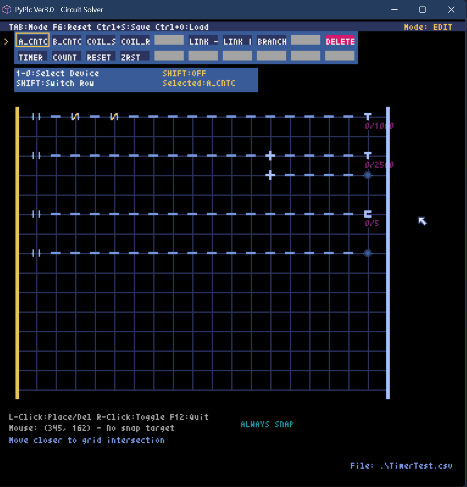
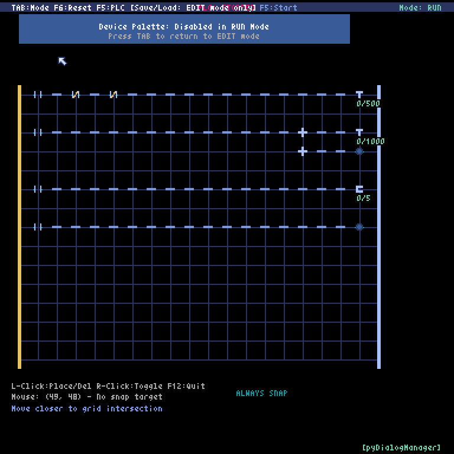

<h1 id="ja">PyPlc Ver3 - PLC標準準拠ラダー図シミュレーター</h1>

[]() 
[]() 
[]()
[]()

**[English](#en) | [日本語](#ja)**




## 概要

PyPlc Ver3は、工場検証用途と教育目的を兼ねたPLC標準準拠のラダー図シミュレーターです。
実際のPLCプログラミングと同等の操作感を提供し、接点・コイル・タイマー・カウンター・データレジスタ等の基本機能を完全実装しています。

**高品質コード**: WindSurf AI AssistantによるA+評価（商用製品レベル）を獲得済み

## 主要機能

### 完全実装済み機能
- **基本デバイス**: A/B接点、通常/反転コイル、配線系（水平・垂直・分岐）
- **高度機能**: タイマー（TON）、カウンター（CTU）、RST/ZRST命令
- **データ処理**: データレジスタ（MOV/ADD/SUB/MUL/DIV操作）
- **UI/UX**: デバイスパレット、右クリック編集、ファイル保存/読み込み
- **回路解析**: リアルタイム電力フロー解析、30FPS高速動作
- **教育支援**: PLC標準アドレス体系、同一アドレスハイライト表示

### 特徴
- **PLC標準完全準拠**: 三菱PLC準拠のアドレス体系・動作仕様
- **教育的価値**: 実PLC移行時の違和感なし
- **商用品質**: WindSurf A+評価の高品質アーキテクチャ
- **モジュラー設計**: 責任分離原則に基づくクリーン実装
- **JSONベースダイアログ**: 高度なダイアログシステム

## インストール・実行

### 必要環境
- Python 3.8以上
- Pyxel 1.9.0以上
- 対応OS: Windows/Linux/macOS

### インストール
```bash
# 依存関係インストール
pip install pyxel

# または通常実行
pyxel run main.py
```

## 基本操作

### モード切り替え
- **TAB**: EDIT/RUNモード切り替え
- **F5**: PLC実行開始/停止（RUNモードのみ）
- **F6**: 全システムリセット
- **F12**: アプリケーション終了

### デバイス配置・編集
- **1-0キー**: デバイス選択（デバイスパレット）
- **Shift+数字**: 下段デバイス選択
- **マウス左クリック**: デバイス配置/削除
- **マウス右クリック**: デバイスID・設定編集
- **ドラッグ**: LINK_HORZ（水平配線）の連続配置

### ファイル操作
- **Ctrl+S**: 回路保存ダイアログ
- **Ctrl+O**: 回路読み込みダイアログ
- **CSV形式**: 回路データの保存/読み込み

### デバイス操作（RUNモード）
- **マウス右クリック**: 接点のON/OFF切り替え

## デバイス一覧

### 基本デバイス（上段：通常選択）
| キー | デバイス | 説明 | 表記 |
|------|----------|------|------|
| 1 | A接点 | ノーマルオープン接点 | -\|├\|- |
| 2 | B接点 | ノーマルクローズ接点 | -\|/\|- |
| 3 | 通常コイル | 出力コイル | -( )- |
| 4 | 反転コイル | 反転出力コイル | -(/)- |
| 5 | 水平配線 | 水平接続 | ──── |
| 6 | 下方分岐 | 下方向分岐 | ┬ |
| 7 | 上方分岐 | 上方向分岐 | ┴ |
| 8 | 垂直配線 | 垂直接続 | \| |
| 0 | 削除 | デバイス除去 | － |

### 高度デバイス（下段：Shift+数字）
| キー | デバイス | 説明 |
|------|----------|------|
| Shift+1 | タイマー | TON（オンディレイタイマー） |
| Shift+2 | カウンター | CTU（アップカウンター） |
| Shift+3 | RST命令 | リセット命令 |
| Shift+4 | ZRST命令 | 範囲リセット命令 |
| Shift+5 | データレジスタ | データ処理デバイス |

## PLC標準アドレス体系

### 入力デバイス (X)
- **範囲**: X000-X377（8進数）
- **用途**: 物理的な入力デバイス（スイッチ、センサー等）

### 出力デバイス (Y)  
- **範囲**: Y000-Y377（8進数）
- **用途**: 物理的な出力デバイス（ランプ、リレー等）

### 内部リレー (M)
- **範囲**: M0-M7999（10進数）
- **用途**: プログラム内部で使用する補助リレー

### タイマー (T)
- **範囲**: T000-T255（10進数）
- **プリセット値**: 0-32767（0.1秒単位）
- **動作**: TON（オンディレイタイマー）

### カウンター (C)
- **範囲**: C000-C255（10進数）
- **プリセット値**: 0-65535（回数）
- **動作**: CTU（アップカウンター）

### データレジスタ (D)
- **範囲**: D0-D7999（10進数）
- **操作**: MOV/ADD/SUB/MUL/DIV
- **用途**: 数値データの保持・演算

## 技術仕様

### 表示・パフォーマンス
- **解像度**: 384×384ピクセル
- **グリッドシステム**: 15行×20列
- **フレームレート**: 30FPS安定動作
- **回路解析**: 深度優先探索アルゴリズム

### アーキテクチャ
- **設計思想**: モジュール化、責任分離原則
- **コード品質**: WindSurf A+評価（商用製品レベル）
- **保守性**: 拡張容易な設計、包括的コメント
- **互換性**: PLC標準準拠、実機移行対応

### ダイアログシステム
- **JSONベース**: 設定可能なダイアログレイアウト
- **バリデーション**: リアルタイム入力検証
- **ファイル操作**: 高度なファイル保存/読み込み機能

## プロジェクト構造

```
PyPlc/
├── main.py                      # メインアプリケーション
├── config.py                    # 設定定数（デバイス種別、UI設定等）
├── core/                        # コアモジュール
│   ├── circuit_analyzer.py      # 回路解析エンジン
│   ├── grid_system.py           # グリッド管理・デバイス描画
│   ├── device_base.py           # PLCデバイス基底クラス
│   ├── device_palette.py        # デバイス選択パレット
│   ├── input_handler.py         # マウス・キーボード入力処理
│   ├── circuit_csv_manager.py   # CSV保存/読み込み機能
│   └── SpriteManager.py         # スプライト管理システム
├── pyDialogManager/             # 高度ダイアログシステム
│   ├── dialog_manager.py        # ダイアログ統合管理
│   ├── dialog_system.py         # ダイアログシステム核
│   ├── widgets.py               # UI基本ウィジェット
│   ├── file_open_dialog.py      # ファイル開くダイアログ
│   ├── file_save_dialog.py      # ファイル保存ダイアログ
│   ├── device_id_dialog_controller.py  # デバイスID編集
│   ├── timer_counter_dialog_controller.py  # タイマー・カウンター設定
│   ├── data_register_dialog_controller.py  # データレジスタ設定
│   └── dialogs.json             # ダイアログ定義ファイル
├── sprites.json                 # スプライト定義
├── my_resource.pyxres           # Pyxelリソースファイル

#pyDialogManagerは本プロジェクトからの派生プロジェクトとして、現在は独立リポジトリとなっています
https://github.com/Edo-Hachi/pyDialogManager

## 開発履歴と成果

### Ver3の主要成果（2025年8月ー）
- **Phase 1-5**: 基本システム～ダイアログリファクタリング完了
- **アーキテクチャ**: 責任分離設計・モジュール化・高品質コード実現
- **PLC準拠**: 三菱GxWorksを基準として教育につかえるようにする(努力)
- **教育価値**: 実用PLCとの完全互換動作をめざす(完全はなどない)
- **技術革新**: LINK_BRANCH垂直接続システム（125行→15行に削減 最適化がんばった）

### 品質保証
- **コードレビュー**: WindSurf,Cursor,ClaudeCode,GeminiCLI評価
- **設計品質**: 「商用製品レベルの完成度」評価  (AIのハードル低くて助かる)
- **パフォーマンス**: 0.11ms平均実行時間（30FPS要件の300倍高速）Pyxelは最大60fpsなので、まぁ、そんなに最適化がんばらんでも
- **教育効果**: 「実PLC準拠の純粋実装」評価 初学者にPLCとは何ぞやと伝えるためには十分かと

### Ver1/Ver2からの進化
- **Ver1**: プロトタイプ（内部データと表示の不整合問題）
- **Ver2**: モジュール化・安定化
- **Ver3**: PLC標準準拠・教育効果最大化（現在版）

## 動作確認済み機能

### 基本回路
- 単純接点・コイル回路
- 自己保持回路（シーケンス制御）
- 並列・直列接続回路
- 複雑分岐回路（LINK_BRANCH使用）

### 高度機能
- タイマー制御（1秒精度）
- カウンター制御（立ち上がりエッジ検出）
- RST/ZRST命令（単体・範囲指定）
- データレジスタ操作（5種類の演算）
- Compareを追加

### システム機能
- CSV保存/読み込み（ファイル名自動管理）
- リアルタイム回路解析
- デバイスID編集・バリデーション
- 同一アドレスハイライト表示

## ライセンス

このプロジェクトは継続開発中です。教育目的・研究目的での使用を歓迎します。

---

**開発状況**: アクティブ開発継続中  
**最終更新**: 2025-08-19  
**対象ユーザー**: PLCエンジニア、自動化技術学習者、工業教育関係者

**次期開発計画**: 応用PLC機能（SET/RST拡張、データレジスタ高度操作、複雑回路パターン対応）
**Raspberry PiのGPIO制御による、実デバイス制御

---

<h1 id="en">English Version</h1>

# PyPlc Ver3 - PLC Standard-Compliant Ladder Diagram Simulator

[]() 
[]() 
[]()
[]()

**[English](#en) | [日本語](#ja)**


## Overview

PyPlc Ver3 is a PLC standard-compliant ladder diagram simulator designed for both factory verification and educational purposes.
It provides an operational experience equivalent to actual PLC programming and fully implements basic functions including contacts, coils, timers, counters, and data registers.

**High-Quality Code**: Achieved A+ rating (commercial product level) from WindSurf AI Assistant

## Key Features

### Fully Implemented Functions
- **Basic Devices**: A/B contacts, normal/reverse coils, wiring systems (horizontal/vertical/branch)
- **Advanced Functions**: Timer (TON), Counter (CTU), RST/ZRST commands
- **Data Processing**: Data registers (MOV/ADD/SUB/MUL/DIV operations)
- **UI/UX**: Device palette, right-click editing, file save/load
- **Circuit Analysis**: Real-time power flow analysis, 30FPS high-speed operation
- **Educational Support**: PLC standard address system, same address highlighting

### Features
- **Full PLC Standard Compliance**: Address system and operation specifications based on Mitsubishi PLC
- **Educational Value**: Seamless transition to real PLCs
- **Commercial Quality**: High-quality architecture with WindSurf A+ rating
- **Modular Design**: Clean implementation based on separation of concerns
- **JSON-based Dialogs**: Advanced dialog system

## Installation & Execution

### System Requirements
- Python 3.8 or higher
- Pyxel 1.9.0 or higher
- Supported OS: Windows/Linux/macOS

### Installation
```bash
# Install dependencies
pip install pyxel

# Standard execution
pyxel run main.py
```

## Basic Operations

### Mode Switching
- **TAB**: EDIT/RUN mode switching
- **F5**: PLC execution start/stop (RUN mode only)
- **F6**: Full system reset
- **F12**: Application exit

### Device Placement & Editing
- **1-0 Keys**: Device selection (device palette)
- **Shift+Numbers**: Lower row device selection
- **Left Mouse Click**: Device placement/deletion
- **Right Mouse Click**: Device ID/settings editing
- **Drag**: Continuous placement of LINK_HORZ (horizontal wiring)

### File Operations
- **Ctrl+S**: Circuit save dialog
- **Ctrl+O**: Circuit load dialog
- **CSV Format**: Circuit data save/load

### Device Operations (RUN Mode)
- **Right Mouse Click**: Contact ON/OFF switching

## Device List

### Basic Devices (Upper Row: Normal Selection)
| Key | Device | Description | Notation |
|-----|--------|-------------|----------|
| 1 | A Contact | Normally Open Contact | -\|├\|- |
| 2 | B Contact | Normally Closed Contact | -\|/\|- |
| 3 | Normal Coil | Output Coil | -( )- |
| 4 | Reverse Coil | Reverse Output Coil | -(/)- |
| 5 | Horizontal Wire | Horizontal Connection | ──── |
| 6 | Down Branch | Downward Branch | ┬ |
| 7 | Up Branch | Upward Branch | ┴ |
| 8 | Vertical Wire | Vertical Connection | \| |
| 0 | Delete | Device Removal | － |

### Advanced Devices (Lower Row: Shift+Numbers)
| Key | Device | Description |
|-----|--------|-------------|
| Shift+1 | Timer | TON (On-Delay Timer) |
| Shift+2 | Counter | CTU (Up Counter) |
| Shift+3 | RST Command | Reset Command |
| Shift+4 | ZRST Command | Range Reset Command |
| Shift+5 | Data Register | Data Processing Device |

## PLC Standard Address System

### Input Devices (X)
- **Range**: X000-X377 (Octal)
- **Purpose**: Physical input devices (switches, sensors, etc.)

### Output Devices (Y)
- **Range**: Y000-Y377 (Octal)
- **Purpose**: Physical output devices (lamps, relays, etc.)

### Internal Relays (M)
- **Range**: M0-M7999 (Decimal)
- **Purpose**: Auxiliary relays used internally in programs

### Timers (T)
- **Range**: T000-T255 (Decimal)
- **Preset Value**: 0-32767 (0.1 second units)
- **Operation**: TON (On-Delay Timer)

### Counters (C)
- **Range**: C000-C255 (Decimal)
- **Preset Value**: 0-65535 (counts)
- **Operation**: CTU (Up Counter)

### Data Registers (D)
- **Range**: D0-D7999 (Decimal)
- **Operations**: MOV/ADD/SUB/MUL/DIV
- **Purpose**: Numerical data storage and arithmetic

## Technical Specifications

### Display & Performance
- **Resolution**: 384×384 pixels
- **Grid System**: 15 rows × 20 columns
- **Frame Rate**: 30FPS stable operation
- **Circuit Analysis**: Depth-first search algorithm

### Architecture
- **Design Philosophy**: Modularization, separation of concerns
- **Code Quality**: WindSurf A+ rating (commercial product level)
- **Maintainability**: Easily extensible design, comprehensive comments
- **Compatibility**: PLC standard compliance, real device migration support

### Dialog System
- **JSON-based**: Configurable dialog layouts
- **Validation**: Real-time input validation
- **File Operations**: Advanced file save/load functionality

## Project Structure

```
PyPlc/
├── main.py                      # Main application
├── config.py                    # Configuration constants (device types, UI settings, etc.)
├── core/                        # Core modules
│   ├── circuit_analyzer.py      # Circuit analysis engine
│   ├── grid_system.py           # Grid management & device rendering
│   ├── device_base.py           # PLC device base class
│   ├── device_palette.py        # Device selection palette
│   ├── input_handler.py         # Mouse & keyboard input processing
│   ├── circuit_csv_manager.py   # CSV save/load functionality
│   └── SpriteManager.py         # Sprite management system
├── pyDialogManager/             # Advanced dialog system
│   ├── dialog_manager.py        # Dialog integration management
│   ├── dialog_system.py         # Dialog system core
│   ├── widgets.py               # Basic UI widgets
│   ├── file_open_dialog.py      # File open dialog
│   ├── file_save_dialog.py      # File save dialog
│   ├── device_id_dialog_controller.py  # Device ID editing
│   ├── timer_counter_dialog_controller.py  # Timer/Counter settings
│   ├── data_register_dialog_controller.py  # Data register settings
│   └── dialogs.json             # Dialog definition file
├── sprites.json                 # Sprite definitions
├── my_resource.pyxres           # Pyxel resource file

# pyDialogManager has become an independent repository as a derivative project
https://github.com/Edo-Hachi/pyDialogManager
```

## Development History & Achievements

### Ver3 Major Achievements (2025)
- **Phase 1-5**: Basic system to dialog refactoring completed
- **Architecture**: Separation of concerns design, modularization, high-quality code realization
- **PLC Compliance**: Based on Mitsubishi GxWorks for educational use
- **Educational Value**: Aiming for complete compatibility with practical PLCs
- **Technical Innovation**: LINK_BRANCH vertical connection system (reduced from 125 to 15 lines)

### Quality Assurance
- **Code Review**: WindSurf, Cursor, ClaudeCode, GeminiCLI evaluations
- **Design Quality**: "Commercial product level completion" evaluation
- **Performance**: 0.11ms average execution time (300x faster than 30FPS requirement)
- **Educational Effect**: "Pure implementation compliant with real PLCs" evaluation

### Evolution from Ver1/Ver2
- **Ver1**: Prototype (internal data and display inconsistency issues)
- **Ver2**: Modularization and stabilization
- **Ver3**: PLC standard compliance and educational effectiveness maximization (current version)

## Verified Functions

### Basic Circuits
- Simple contact/coil circuits
- Self-holding circuits (sequence control)
- Parallel/series connection circuits
- Complex branch circuits (using LINK_BRANCH)

### Advanced Functions
- Timer control (1-second precision)
- Counter control (rising edge detection)
- RST/ZRST commands (single/range specification)
- Data register operations (5 types of arithmetic)

### System Functions
- CSV save/load (automatic filename management)
- Real-time circuit analysis
- Device ID editing & validation
- Same address highlighting display

## License

This project is under continuous development. Educational and research purposes are welcome.

---

**Development Status**: Active development ongoing  
**Last Updated**: August 19, 2025  
**Target Users**: PLC engineers, automation technology learners, industrial education professionals

**Future Development Plans**: Advanced PLC functions (SET/RST extensions, advanced data register operations, complex circuit pattern support)
**Real device control via Raspberry Pi GPIO control
